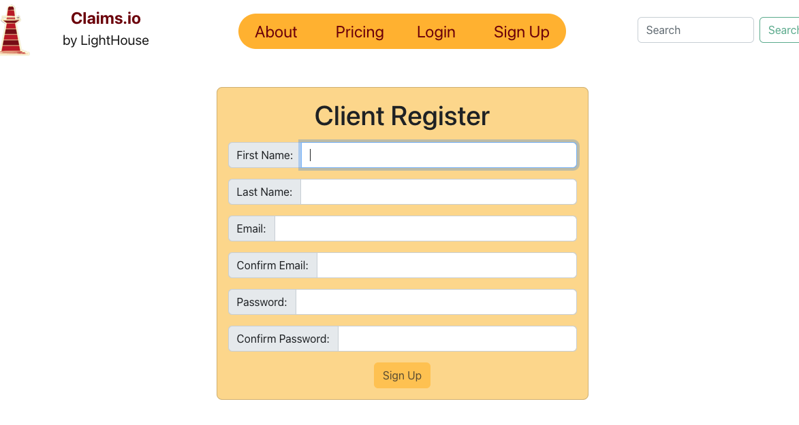

# Welcome to Claims.io version 1-Alpha

## Description

Claims.io is a full service platform designed for the insurance space (front-end currently in development), curated to sign up new clients, assign them to agents, manage claims with role-based permissions, and retain secure client and policy data. Please check in with us frequently for more updates!

### Frontend Highlights
A ReactJS front-end with a for encrypted data sent over the API, a global React Context API to cross reference valid user identity from client to server through secure HTTP cookies and track sensitive data retrieved from the database. Multiple custom hooks are implemented to manage navigation, API routing, authentication, and authorization state. React Bootstrap and css for component styling. 

### Backend Highlights
A Express Node.js server runtime, each user recieves a JWT Access & Refresh token pair for time sensitive access complete with brcrypt password hashing and decoding. Authentication middleware routing for secure data access, & authorization middleware for verifing employee roles for selected permissions and access to data. Server side validation on a MongoDB database with Mongoose ODM for consistency and to prevent duplicate and null or conflicting user input.

### Deployed Claims Application: https://claimsio-production.up.railway.app

## Table of Contents

- [Installation](#installation)

- [How to Use](#how-to-use)

- [Future Development](#future-development)

- [License](#license)

- [Contact](#contact)

## Installation

### 1. Clone the repository above.
### 2. ` npm install ` to download dependencies.
### 3. ` npm run develop ` for the dev environment.

## How to Use

### Head Over Too:
https://claimsio-production.up.railway.app

### Create a Test Client or Agent Account:

#### Client Signup Demo Image: 

### Sign In with your New Account:

#### Agent Signin Demo Image:

### OR

### Checkout our Tester GET REST API Routes
https://claimsio-production.up.railway.app/api/users/

https://claimsio-production.up.railway.app/api/employees/

https://claimsio-production.up.railway.app/api/employees/claims

## Future Development

Claims.io will feature multiple user-agent interaction features, client and server-side Authenication, and more, please stay tuned for more updates!

## License

## Contact

### Email

[Contact Email](mailto:create.jasminedaniels@gmail.com)

### Github

[Github](https://github.com/JasmineDaniels)