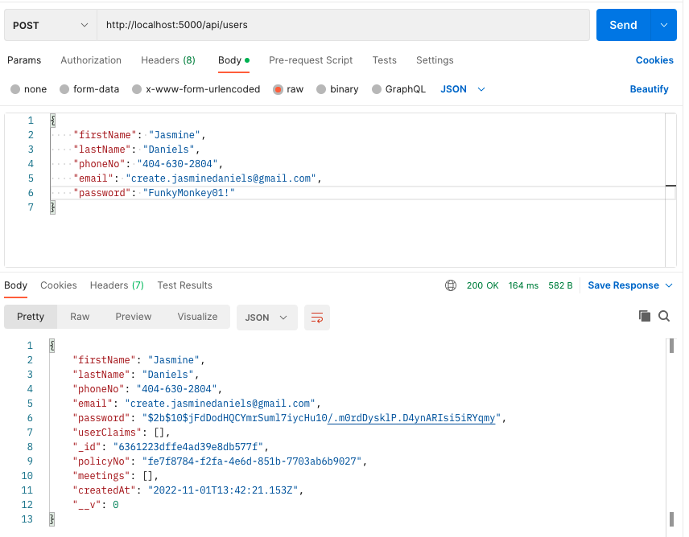

# Welcome to Claims.io

## Description

Claims.io is a RESTful API designed for the insurance space (currently in development), (front-end is in prod), curated to sign up new clients, assign them to agents, and retain secure client and policy data.

An Express Node.js server runtime, JWT Access & Refresh token for sign in and encrypted data sent over the API (currently in development), brcrypt password hashing and decoding, with server side validation. Data is currently stored locally on a MongoDB database with mongoose ODM, application will be hosted within the week!

## Table of Contents

- [Installation](#installation)

- [How to Use](#how-to-use)

- [Future Development](#future-development)

- [License](#license)

- [Contact](#contact)

## Installation

### 1. Clone the repository above.
### 2. ` npm install ` to download dependencies.
### 4. ` npm start ` for the server environment.

## How to Use

### 1. Download Postman or Insomnia:

### 2. Use Models in the `server/models` folder for user input reference 

### User Input Example:

## Future Development

Claims.io will feature a React front-end with multiple user-agent interaction features, client and serve-side Authenication, and more, please stay tuned for more updates!

## License

## Contact

### Email

[Contact Email](mailto:create.jasminedaniels@gmail.com)

### Github

[Github](https://github.com/JasmineDaniels)